Launch Cognos Analytics

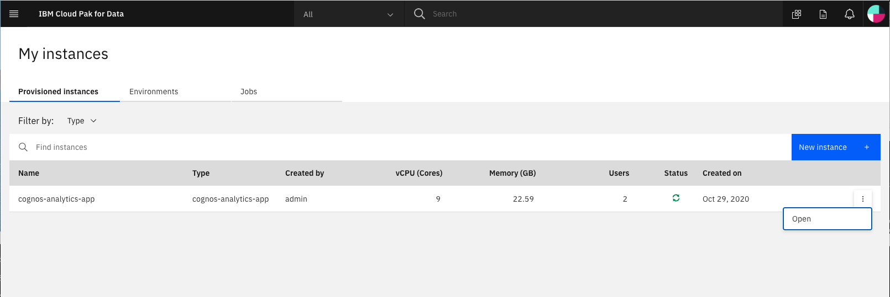

Upload data files

* german_credit_data.csv
* history_business_payloads.csv

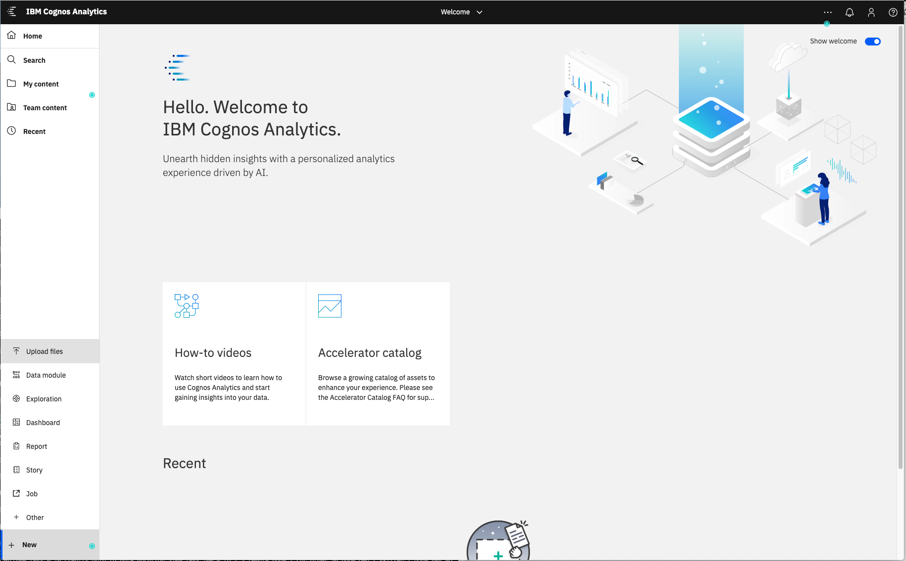

Files should now be added to your `My content` folder

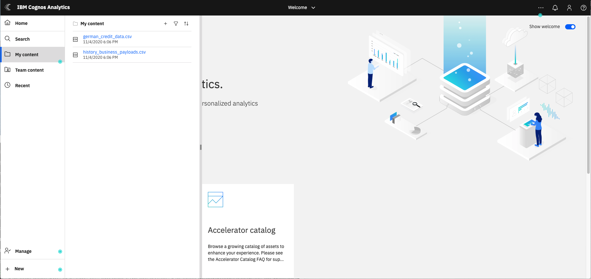

## Create a dashboard

From the Cognos Analytics main dashboard, select the `+` icon in the lower left corner and select `Dashboard`. Accept the default template and click `Create`.

Once the dashboard panel appears, click on the `Select a source` button.

From the `Add a data source` dialog, navigate to your `My content` folder and select the `german_credit_risk_data.csv` file

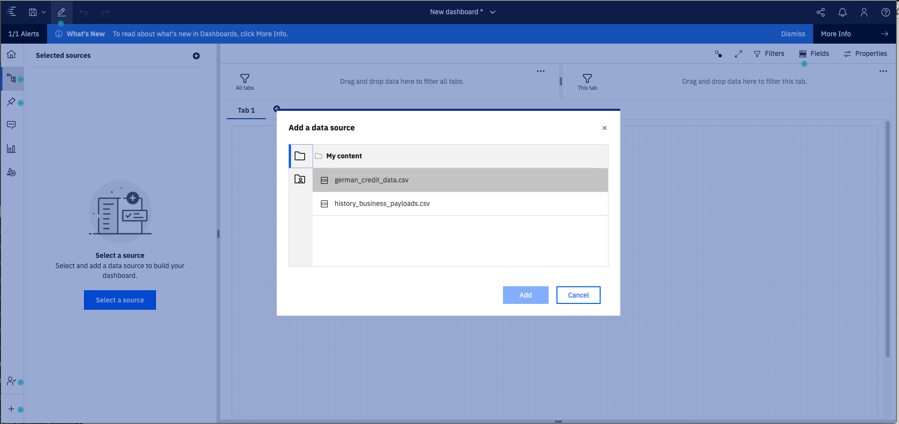

You should then see a blank canvas to create your dashboard.

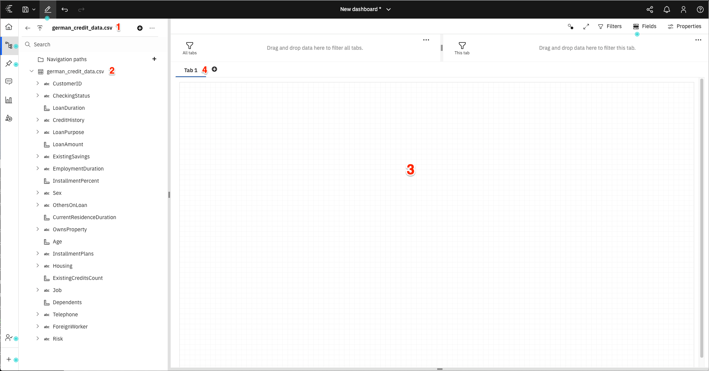

From the image above:

* [1] The data module currently associated with the dashboard.
* [2] The resources included in the data module.
* [3] The dashboard canvas.
* [4] The tabs defined for the dashboard.

To create your dashboard, you will need to become knowledgeable with the numerous tools available from icons and pop-up menus.

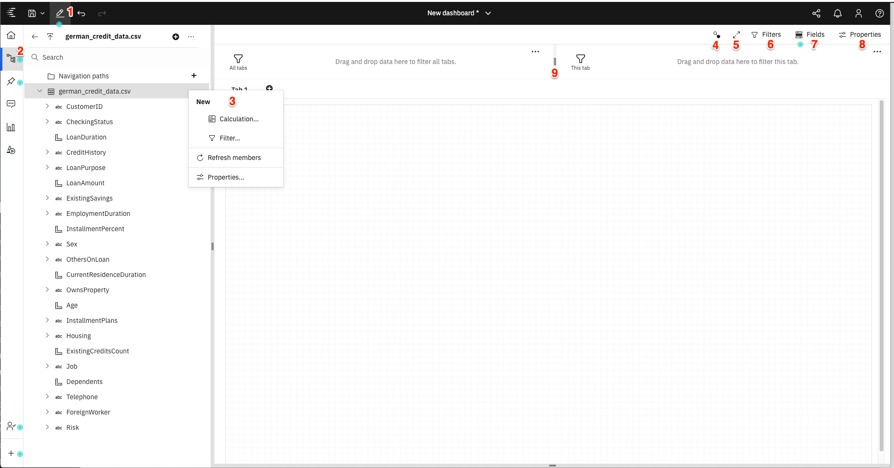

From the image above:

* [1] Toggles you between edit and preview mode.
* [2] Toggles display of the resouces (data objects) in the data module.
* [3] An example of one of many drop-down menus associated with data objects.
* [4] Displays the relationship between all of the visual objects on your dashboard. Objects with the same number are related.
* [5] Toggles full-screen mode on and off.
* [6] Toggles display of the filter panels.
* [7] Displays the fields associated with the selected visual object.
* [8] Displays the properties associated with the selected visual object.
* [9] Filters that can be applied to dashboard visual objects. The filter can be set for all dashboard tabs (left side), or for the current tab (right side).

The types of visualizations available include the following:

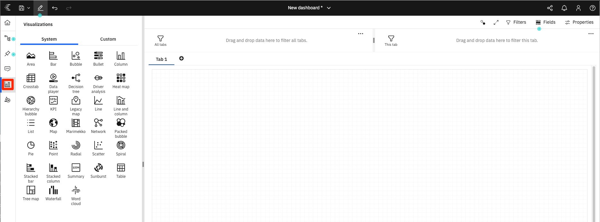

### Spiral visualization to show main drivers to determine credit risk

Our first visualization we will be a spiral which will rank how important each of the drivers are in determining credit risk.

Select the PredictedRisk field in the german_credit_risk_new_apps_scored file in the data source list and drag it onto the canvas.

The toolbar at the top of the window is active for the currently selected visualization. For convenience, you can click on Undock toolbar to have the toolbar snap next to the selected visualization.

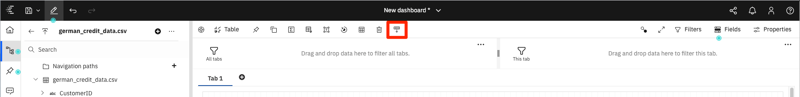

Click on the anchor icon to bring up the toolbar for the visualization. Then click on the `Change visualization` tool. In this particular case, the default visualization choosen for the data type is a `table`. We need to change this to a `spiral`.

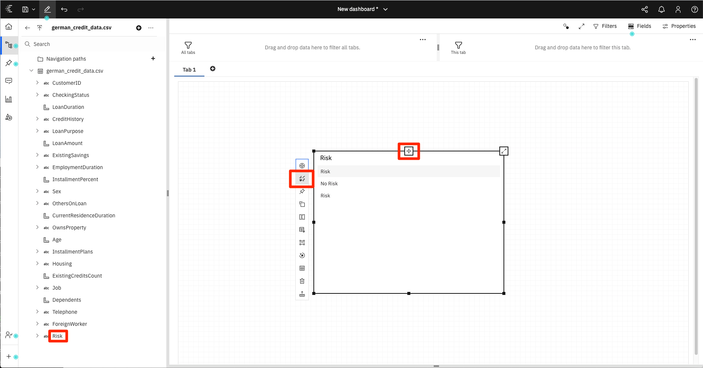

From the pop-up menu, click `All visualiztions` to open up the list of available visualizations. Select `spiral`.

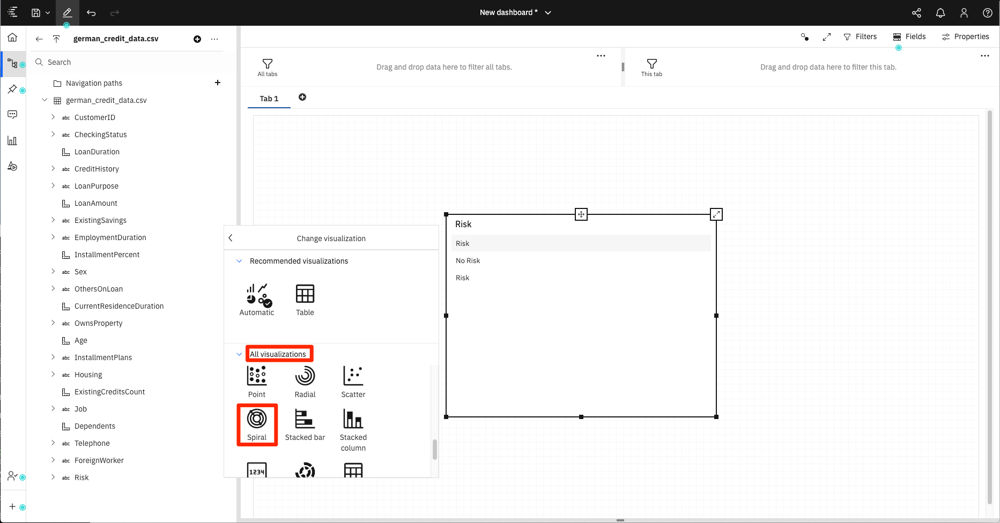

From the visualization toolbar, click on the `Edit the title` icon, and set the title to "Greatest predictors of Risk".

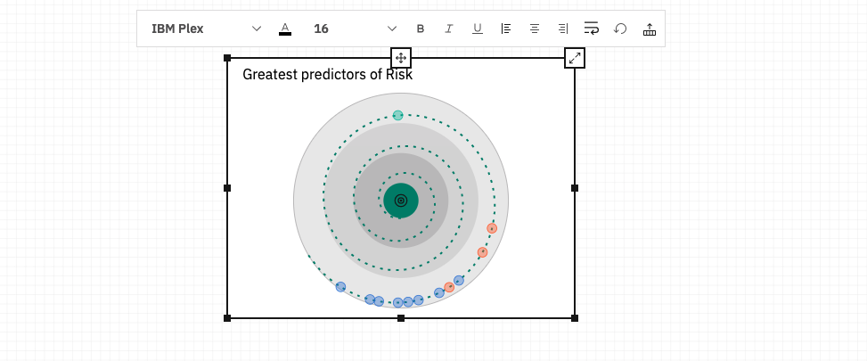

Use the box sizing tools to position the box in the upper left-hand corner of the dashboard.

Use the Expand/Collapse button in the upper right-hand corner of your visualization to view in expanded mode or to collapse the view in your dashboard canvas.

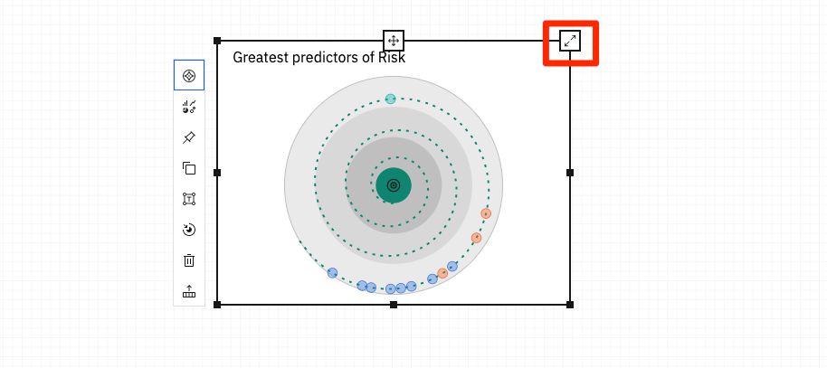

As you can see, the spiral visualization ranks the drivers that influence the target field - `Risk`.

> **NOTE**: Click the `Filters` button to turn on/off the filters displayed at the top of the window. Click the `collapse` icon in the top-right corner to collapse the visualization.

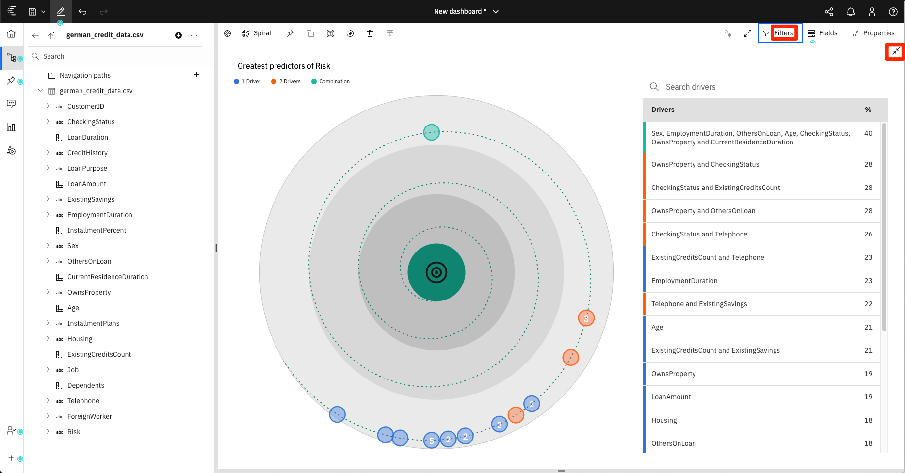

Use the `Fields` tab to change what the visualization is based on, and use the `Properties` tab to modify the look and feel of the visualization.

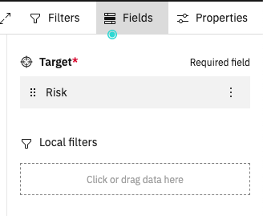

### List visualization to show the effect of loan amount and loan length on risk

Next we will show what effect Loan Amount and Loan Duration have on credit risk.

Start by clicking on  the `+` icon in the tabs bar to create a new tab where we can create our visualization.

Click the Visualizations icon in the left navigation bar and select the `Line` graph icon and drap it onto the canvas.

With the new visualization selected, click on the Fields tab.

Going back to our resource list, from the `german_credit_data` file, drag `LoanAmount` to the `x-axis` field, `LoanDuration` to the `y-axis` field, and `Risk` to the `Color` field.

> **NOTE**: You can also drag the items directly to the designated spots displayed on the `List` object.

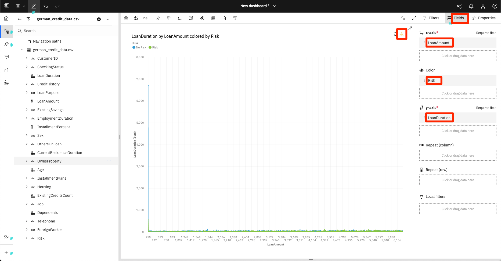

This initial graph layout is too compact, and a warning icon is displayed in the upper right corner. The warning states that multiple items had to be clipped and that we should apply a filter to show less data.

Make the suggested adjustment by clicking the menu for the `Loan Amount` field, then enabling the `Auto-group` option.

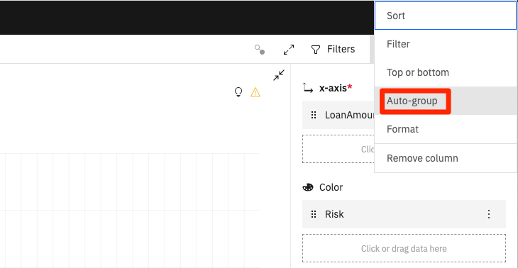

This will result in a much more useful chart.

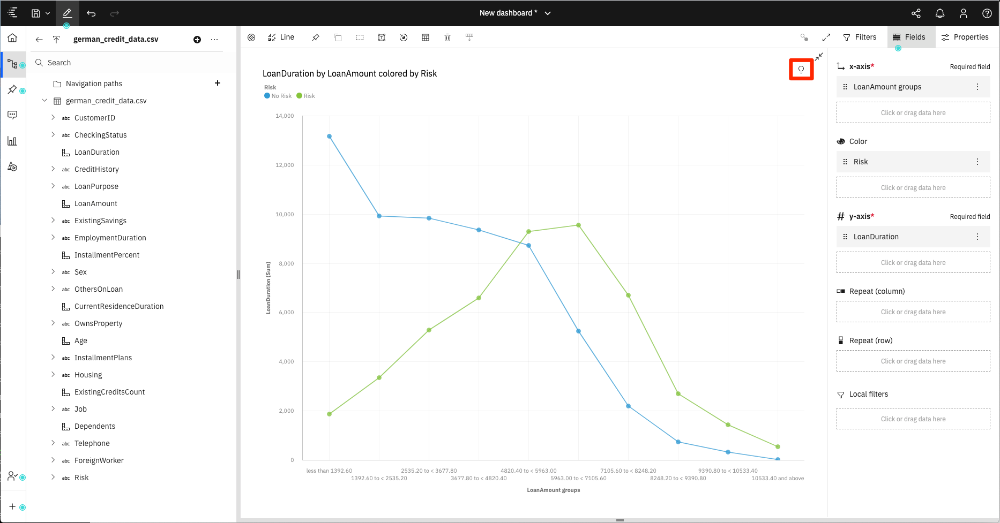

Here we can see that the least risky loans are for small loan amount that have a large loan duration.

To get more insights into the data, click on the `light bulb` icon in the upper right of the canvas.

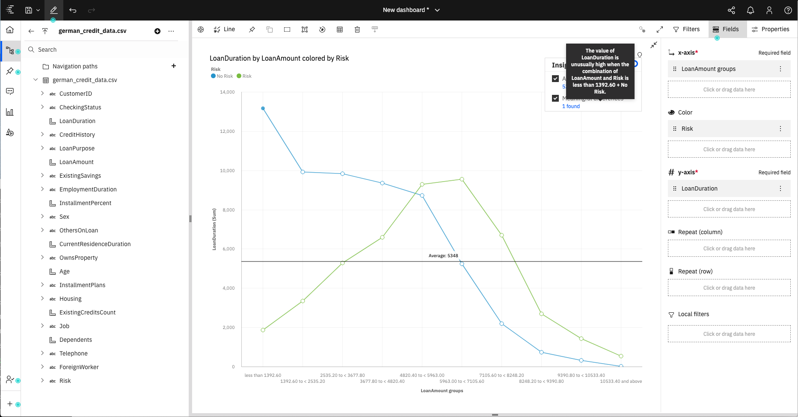

If desired, you can use the `Change color palatte` option under the `Properties` tab to change the line colors.

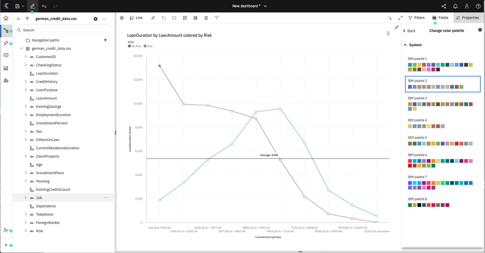

To finish off your visualization, change the title of the visualization to `Loan amount and duration vs risk`.

Click the `Save` icon in the top menu to save your dashboard. Save the dashboard in the `My content` folder.

### Create a data module

The historic data in the `history_business_payloads.csv` file contains a timestamp field. For our next visualization, we would like to show time in a different format. To do this we will need to modify the data by creating a `Data module`.

Click the `+` icon at the bottom of the left-side menu bar and select `Data Module`.

For the source data, select the `history_business_payloads.csv` file from the `My content` folder. Then click `OK`.

The `data module` panel allows you to combine data sets and define relationships. For our case, we will simple `split` the timestamp field into new fields that represent each of the timestamp segments.

From the `Grid` tab, select the `history_business_payloads.csv` entry in the source list.

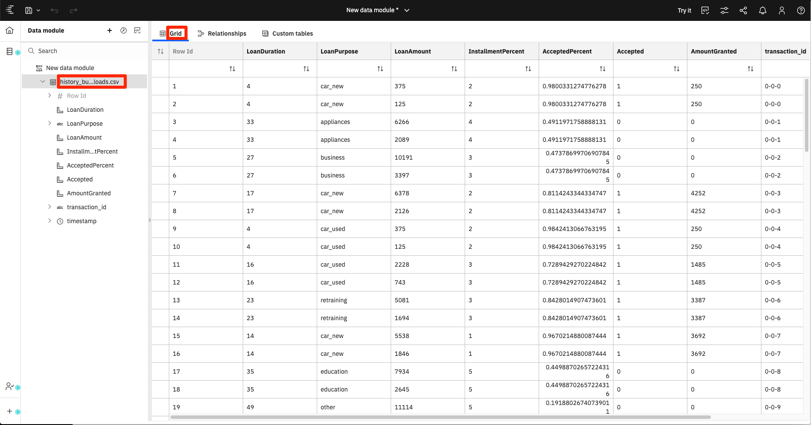

Scoll over to the `timestamp` field, then click on the header to bring up the action menu. Select the `Split` option.

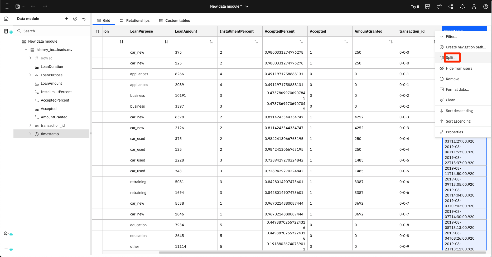

Select `Year`, `Month`, `Day` and `Hour`.

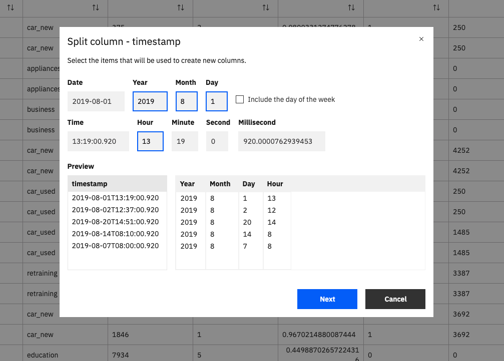

Click `Next`, and then `OK` to complete the process.

The new table will include the new fields.

Click the `Save` icon in the top menu to save your new data module. Name the data module `history-data-module` and save it in the `My content` folder.

### Create history visualization

Click the `+` icon at the bottom of the left-side menu bar and select `Dashboard`. Accept the default template and click `Create`.

For the source data, select the `history_data-module` data module from the `My content` folder.

For this visualization, we will use the `Assistant` feature to help us create our initial graph.

Click the `Assistant` icon in the left-hand tabs to bring up the query panel.

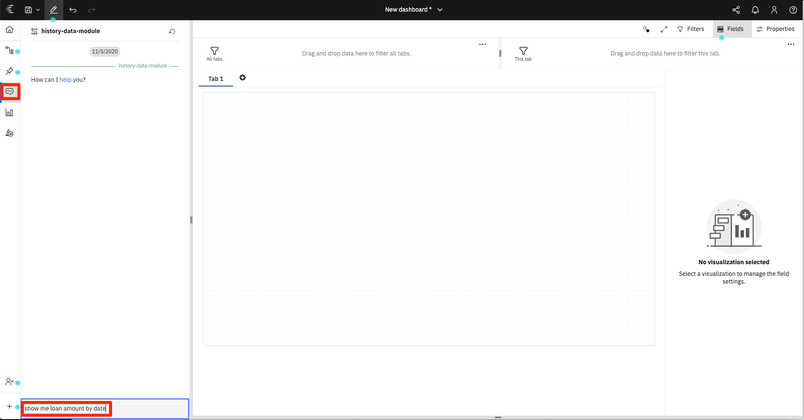

In the query field, enter "show me loan amount by date".

It will return a `Line` chart that you can then drag and drop onto your dashboard canvas.

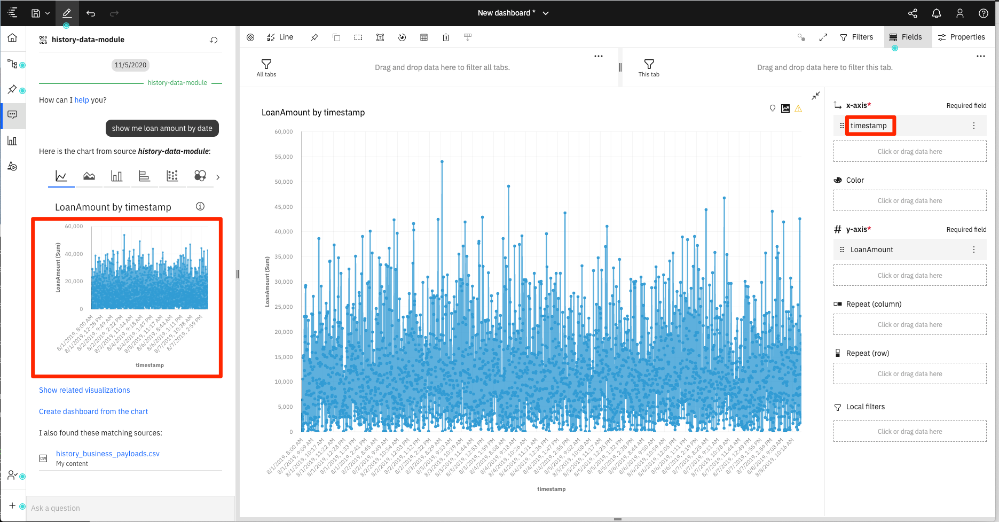

If you click on the `Fields` tab, you will see that it selected `timestamp` as the `x-axis`.

To make the chart less cluttered, we can use our new date fields to summarize load amounts on a daily basis.

Start by going back to the tree view by selecting the `Sources` tab in the left-side menu.

Remove `timestamp` and add in `Year`, `Month` and `Day`.

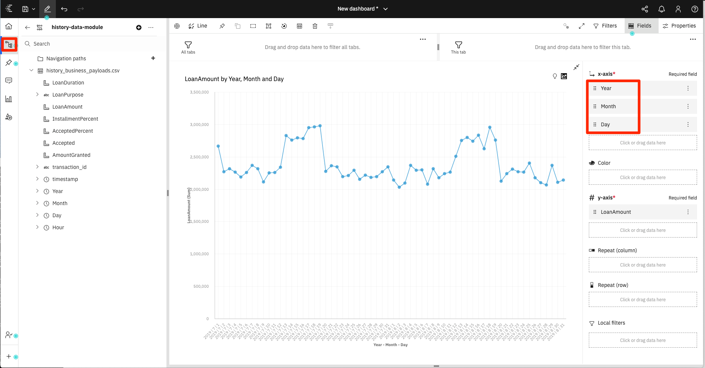

Since the `LoanAmount` values fall into a small range, let's change the value of the y-axis origin.

Click on the `Properties` tab, then select `Visualizations`. Expand the `Chart` options and disable the `Value axis show zero origin` option.

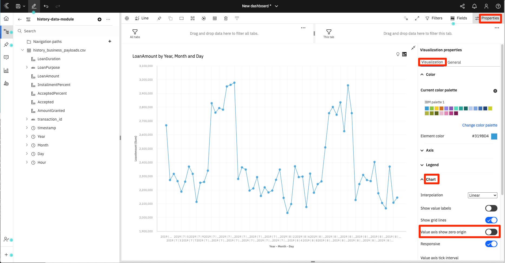

Click on the `Forecast` icon located at the top-right of the chart. When enabled, Cognos Analytics will attempt for forecast future loan amount values.

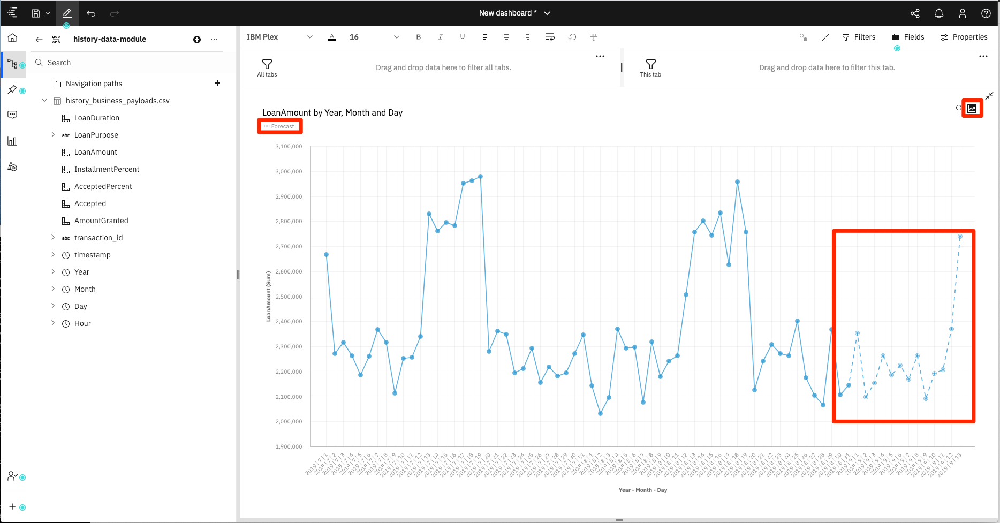

Click on the `light bulb` icon located at the top-right of the chart to enable insights. For this chart, it will show the average loan amount, and highlight some values which are detected as anomolies. If you mouse over the highlighted nodes (filled in circles) you can see the detailed warning.

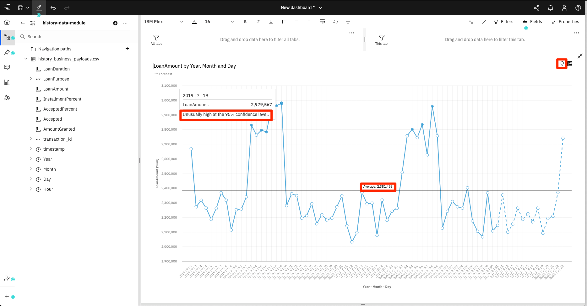

